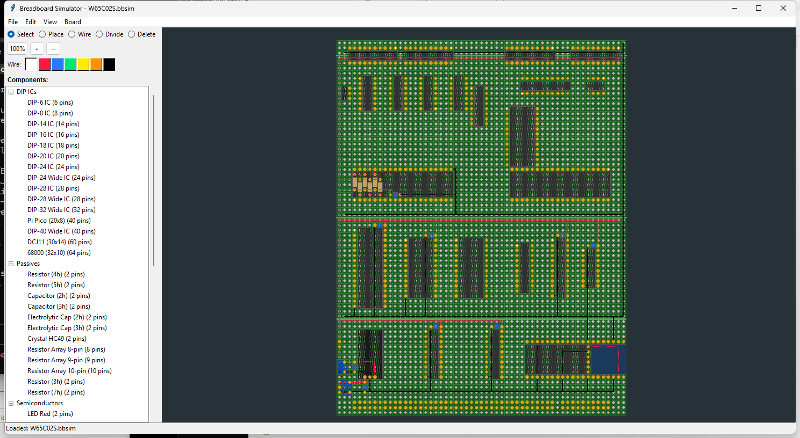

# Breadboard Simulator

Herramienta de visualizacion y planificacion de layouts en perfboard (placa perforada con pads independientes en reticula X*Y). Disenada para el proyecto SBC-WALL pero sirve para cualquier proyecto de electronica.



## Caracteristicas

- **Biblioteca de componentes extensible**: DIP ICs, pasivos (resistencias, capacitores, cristales), semiconductores (transistores, diodos, LEDs), modulos y conectores. Componentes extra definibles via JSON en `library/`.
- **Modos de interaccion**: Select, Place, Wire, Divide y Delete. Cambio rapido por teclado o barra de herramientas.
- **Guias de cableado (wires)**: Dibuja conexiones entre pads con colores configurables. Las guias se dividen automaticamente en intersecciones y pads ocupados.
- **Lineas de division**: Marca zonas del board con lineas verdes entre pads (power rails, secciones logicas, etc.).
- **Undo / Redo ilimitado**: Todas las operaciones (colocar, mover, borrar, cables, divisiones) son reversibles.
- **Zoom y pan fluidos**: Mousewheel para zoom centrado en cursor, arrastre con boton medio o derecho para pan. Tecla `F` para ajustar el board a la ventana.
- **Ghost preview**: Al colocar componentes se muestra una preview verde (posicion valida) o roja (colision).
- **Rotacion**: Cualquier componente se rota en pasos de 90° con `R` antes o despues de colocar.
- **Etiquetas**: Cada componente tiene un label editable (doble click). Se muestra sobre el componente en el canvas.
- **Divisiones del board**: Separa visualmente el board en zonas con lineas horizontales o verticales movibles.
- **Formato .bbsim**: Archivos JSON legibles y editables manualmente. Incluye version, dimensiones, componentes, guias y divisiones.
- **Presets de board**: Tamanios predefinidos o dimensiones custom de 5x5 a 200x200 pads.
- **Instancia unica por archivo**: No se puede abrir el mismo `.bbsim` dos veces; si ya esta abierto, la ventana existente se activa automaticamente.
- **Exportacion PNG**: Menu File > Export PNG (requiere Pillow).

## Requisitos

- Python 3.8+
- tkinter (incluido en la distribucion estandar de Python)
- Pillow (opcional, solo para exportar PNG)
- **Cero dependencias externas obligatorias**

## Instalacion y uso

```bash
# Clonar el repositorio
git clone https://github.com/jlopezmontero/Breadboard-sim.git
cd Breadboard-sim

# Ejecutar
python main.py              # Board nuevo (SBC-WALL 57x74 por defecto)
python main.py layout.bbsim # Abrir archivo existente
```

## Controles

| Tecla / Raton | Accion |
|---------------|--------|
| Click izq. | Seleccionar / Colocar / Borrar (segun modo) |
| Doble click | Editar etiqueta del componente |
| Click medio o derecho + arrastrar | Pan (desplazar vista) |
| Mousewheel | Zoom centrado en cursor |
| **W** | Modo Wire |
| **D** | Modo Divide |
| **X** | Modo Delete |
| **R** | Rotar componente 90° CW |
| **Del** | Borrar componente seleccionado |
| **Esc** | Cancelar / volver a Select |
| **F** | Zoom fit (ajustar al board) |
| **+** / **-** | Zoom in / out |
| **Ctrl+Z** / **Ctrl+Y** | Undo / Redo |
| **Ctrl+S** | Guardar |
| **Ctrl+O** | Abrir |
| **Ctrl+N** | Nuevo board |
| **Ctrl+Q** | Salir |

## Modos de interaccion

- **Select**: Click para seleccionar, arrastrar para mover. Muestra info del componente en la barra de estado.
- **Place**: Seleccionar componente de la palette, click para colocar. Ghost verde = valido, rojo = colision.
- **Wire**: Click y arrastrar para trazar cables horizontales o verticales entre pads. Colores seleccionables.
- **Divide**: Click y arrastrar para crear lineas de division entre zonas del board.
- **Delete**: Click sobre componente o cable para eliminarlo. En cables, borra solo el segmento mas cercano al click.

## Biblioteca de componentes

### Built-in
| Categoria | Ejemplos |
|-----------|---------|
| DIP ICs | DIP-6 al DIP-40, DIP-40 Wide, DCJ11 (60 pins), 68000 (64 pins), Pi Pico |
| Pasivos | Resistencias, capacitores, electroliticos, cristal HC49, arrays de resistencias, SIPs |
| Semiconductores | LED, diodo axial, TO-92, TO-220 |
| Modulos | USB CP2102, USB 4x4 |
| Conectores | Headers 1x2 al 1x40, 2x3 al 2x20 |

### JSON custom (`library/`)
Agrega componentes propios definiendo pins y body cells en coordenadas de grid:

```json
{
  "components": [{
    "type_id": "MOD-MIMODULO",
    "name": "Mi Modulo",
    "ref_prefix": "M",
    "pins": [[0,0], [0,1], [1,0], [1,1]],
    "body_cells": [[0,0], [0,1], [1,0], [1,1]],
    "color": "#4488cc",
    "pin_labels": {"0": "VCC", "1": "GND", "2": "TX", "3": "RX"}
  }]
}
```

## Formato de archivo (.bbsim)

```json
{
  "version": 1,
  "board": {"rows": 57, "cols": 74, "title": "", "label_config": {}},
  "components": [
    {"id": "U1", "type": "DIP-40W", "anchor_row": 5, "anchor_col": 10, "rotation": 0, "label": "W65C02S"}
  ],
  "guides": [[r1, c1, r2, c2, "#color"]],
  "divisions": [[r1, c1, r2, c2]]
}
```

## Presets de board

| Preset | Dimensiones |
|--------|------------|
| 50x70mm | 20x28 pads |
| 70x90mm | 28x36 pads |
| SBC-WALL | 57x74 pads (default) |
| Custom | Definido por usuario (5-200) |

## Estructura del proyecto

```
main.py              # Entry point, lock de instancia unica, setup Tk
gui.py               # Ventana principal: palette, toolbar, canvas, modos, menus
board.py             # Modelo de datos: grid de pads, componentes, guias, divisiones
renderer.py          # Renderizado Canvas: zoom/pan, pads, componentes, guias, labels
components.py        # Geometria de componentes (DIP, axial, radial, QFP, PLCC, etc.)
component_library.py # Gestion de categorias, carga JSON
persistence.py       # Save/Load .bbsim (JSON)
file_lock.py         # Lock de instancia unica por archivo (Windows, ctypes Win32)
library/             # Definiciones JSON de componentes
```

## Build (ejecutable standalone)

```bash
taskkill /F /IM BreadboardSim.exe   # cerrar instancia en ejecucion
pyinstaller BreadboardSim.spec --noconfirm
# Resultado: dist/BreadboardSim.exe (~14 MB, sin dependencias)
```
